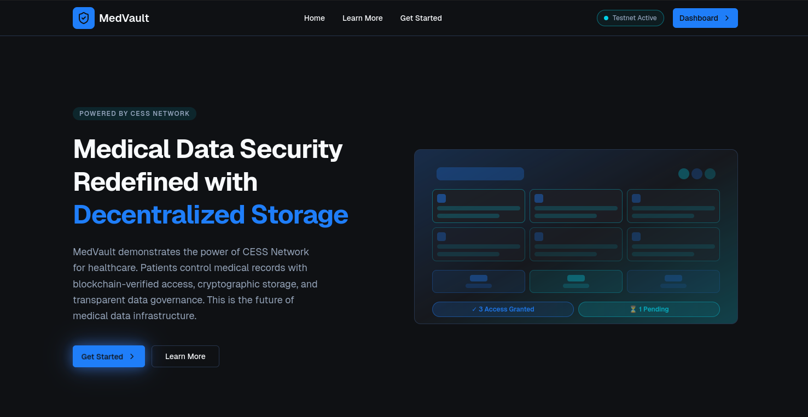
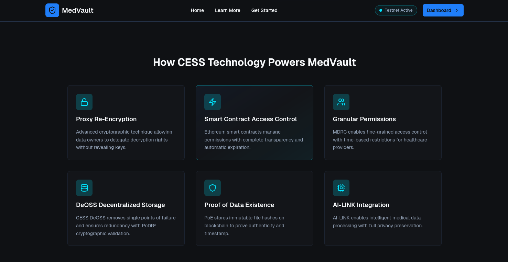
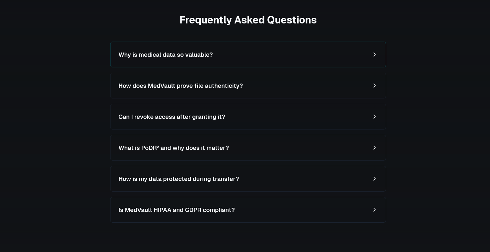
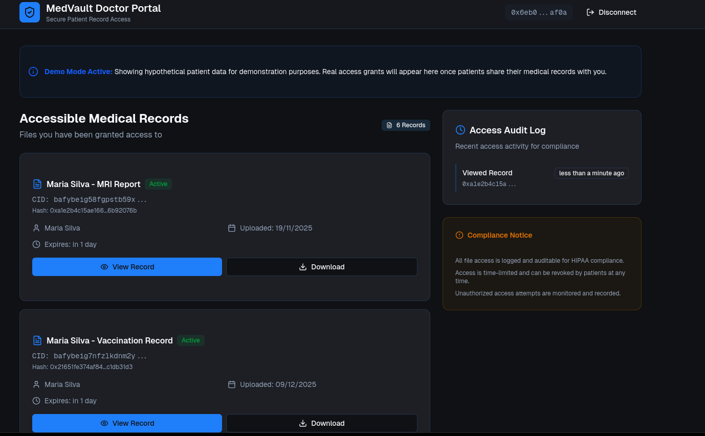

# 🏥 MedVault — Decentralized Medical Data Vault

**Privacy-first. Patient-centered. Built with care. Powered by CESS Network.**

- - -

## 🌐 Project Vision

**MedVault** is more than a decentralized application — it is a statement about how healthcare data _should_ be treated in the digital age. It is a tech revolution.

At its core, MedVault exists to restore what has long been taken away from patients: **true ownership and sovereignty over their own medical data**.

By combining **CESS Network’s Encrypted Decentralized Object Storage (DeOSS)** with **EVM-compatible Smart Contracts**, MedVault removes centralized servers, opaque intermediaries, and trust assumptions that historically put sensitive medical information at risk.

Every design decision in MedVault is guided by one principle: **medical data deserves the same level of protection, dignity, and transparency as human life itself**.

- - -

##  Why MedVault Matters

Healthcare data breaches, fragmented records, and lack of patient control are not just technical failures — they are ethical failures.

MedVault addresses these problems by offering:

*   **Patient Sovereignty** — Data ownership is enforced cryptographically.
*   **Zero Trust Architecture** — No centralized backend, no silent intermediaries.
*   **Transparency & Auditability** — Every access is verifiable and traceable.
*   **Resilience** — Built on decentralized storage and blockchain logic.

CESS Network plays a fundamental role by providing a **trustless, verifiable, and globally distributed storage layer** tailored for sensitive data.

- - -

## 🧠 Architecture Overview
# Front end: 
## 🏠 Front Page

## 📖 Learn More

## ❓ FAQ

## 📊 Dashboard
 


### 🧠 Client-Side Front-End (TCESS Network)

The **Front-End** is the operational core of MedVault and embodies the principle of *patient sovereignty by design*.

All essential operations are executed **entirely on the client side**, directly within the user’s browser, eliminating the need for centralized backend servers. This approach ensures that sensitive medical data is never exposed to third-party intermediaries.

Key responsibilities of the Front-End include:

- Cryptographic file hashing before any upload operation  
- Wallet-based identity verification using the **TCESS network**  
- Secure message signing for CESS DeOSS gateway authorization  
- Direct interaction with the smart contract deployed on **TCESS (CESS Testnet for EVM)**  
- Event listening for on-chain auditability and transparency  

By operating on **TCESS**, MedVault leverages a real blockchain environment while maintaining safety for experimentation and continuous improvement. This allows the system to validate real-world behavior, performance, and security assumptions without compromising production-grade infrastructure.

This architecture guarantees that **the patient remains the sole custodian of their identity, keys, and data** at all times.

---

### ⛓️ On-Chain Smart Contract (TCESS EVM)

The **Smart Contract**, deployed on the **TCESS EVM-compatible network**, serves as the immutable trust layer of MedVault.

It enforces all business logic related to data ownership and access control, acting as the **single source of truth** for medical data permissions.

Core responsibilities include:

- Binding medical file hashes to patient wallet addresses  
- Enforcing immutable ownership rules  
- Managing **time-limited access permissions** for healthcare professionals  
- Automatically revoking access upon expiration  
- Emitting events to support transparent and verifiable auditing  

Because the contract runs on **TCESS**, every permission grant, revocation, or access verification is publicly verifiable, cryptographically secured, and resistant to tampering.

This design removes subjective trust and replaces it with **deterministic, auditable logic**, ensuring fairness and accountability for all participants.

---

### 🗄️ CESS DeOSS Storage (Decentralized & Encrypted)

Actual medical files are stored **off-chain** using **CESS DeOSS (Decentralized Object Storage System)**.

Before storage, all files are cryptographically processed on the client side, ensuring that DeOSS nodes never have access to raw, readable medical data.

CESS DeOSS provides the following guarantees:

- **Data fragmentation**, preventing full file reconstruction by a single node  
- **Geo-redundancy**, increasing availability and resilience  
- **Deduplication**, optimizing storage efficiency  
- **PoDR² (Proof of Data Reduplication and Recovery)**, ensuring data integrity and long-term availability  

This separation between **on-chain metadata** and **off-chain encrypted storage** allows MedVault to scale securely while maintaining strong cryptographic guarantees.

---

## 📤 Secure Upload & On-Chain Registration

MedVault implements a **direct, trust-minimized upload flow** between the client and **CESS DeOSS**.

Files are uploaded **straight from the user’s browser** to the DeOSS gateway, authenticated through **cryptographic signatures** derived from the user’s wallet on the **TCESS network**.

```
PUT /file
# Required headers:
# Territory
# Account
# Message
# Signature
```

- - -

## 🕒 Time-Limited Access Control

MedVault allows patients to grant **temporary, revocable access** to healthcare professionals.

Access permissions **automatically expire**, eliminating forgotten authorizations and significantly reducing long-term exposure risks.

- - -

## 📜 Auditing & Transparency

Every interaction generates **on-chain smart contract events** that can be independently verified.

This mechanism creates a **transparent and immutable audit trail**, strengthening trust between patients and healthcare professionals through cryptographic accountability.

- - -

## 🚀 Future Improvements & Roadmap

MedVault is designed as a **living project**, guided by a clear and responsible vision for future growth.

## 🩺 Professional Doctor Interface
##  Doctor Page



One of the most important upcoming improvements is the implementation of a **dedicated Doctor Page**.

This professional interface will allow authorized doctors and healthcare institutions to:

*   View medical files explicitly shared with them by patients
*   Clearly visualize access expiration times
*   Maintain a verifiable and immutable access history

### 🔐 CESS PReT Integration

Future versions will integrate **CESS Proxy Re-Encryption (PReT)**, enabling secure cryptographic key delegation without exposing private encryption keys or compromising patient privacy.

### 📊 Advanced Analytics & UX Improvements

Planned enhancements include usability refinements, accessibility improvements, and intuitive visual audit dashboards.

These improvements aim to make MedVault not only **secure**, but also **welcoming, transparent, and easy to use** for both patients and healthcare professionals.

- - -

## 📄 License

This project is licensed under the **MIT License**.
